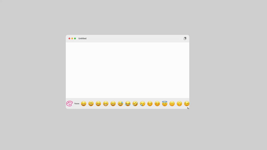

## EmojiArt
This app allows user to make visual arts by adding emojis on different backgrounds

## Description
Emoji Art is a complete app that covers many approaches like Document Architecture, UIKit Integration, Drag/Drop, Gestures, MVVM and others. I have made this application on a course to learn SwiftUI framework.

## The app in the action
### iPad
#### Adding background
<table>
  <tr align="center">
    <td>From the Photo Libruary</td>
    <td>Drag and drop</td>
  </tr>
  <tr align= "center">
    <td width="500"></td>
    <td width="500"></td>
  </tr>
    <tr align="center">
    <td>Copy / paste</td>
  </tr>
  <tr align= "center">
    <td width="500"></td>
  </tr>
 </table>
 
 ---
 #### Background adjustments
<table>
  <tr align= "center">
    <td width="500"></td>
    <td width="500"></td>
  </tr>
 </table>
 
 ---
 #### Emojis
 <table>
  <tr align="center">
    <td>Adding</td>
    <td>Choosing palettes</td>
  </tr>
  <tr align= "center">
    <td width="500"></td>
    <td width="500"></td>
  </tr>
    <tr align="center">
    <td>Managing palettes</td>
    <td>Deleting</td>
  </tr>
  <tr align= "center">
    <td width="500"></td>
    <td width="500"></td>
  </tr>
 </table>
 
---
#### Documents
 <table>
  <tr align="center">
    <td>New document</td>
    <td>Undo / redo</td>
  </tr>
  <tr align= "center">
    <td width="500"></td>
    <td width="500"></td>
  </tr>
 </table>
 
### iPhone

<table>
  <tr align="center">
    <td width="250">Background from the camera</td>
    <td width="250">Some behaviour</td>
    <td width="250">some behaviour</td>
  </tr>
  <tr align= "center">
    <td width="250"></td>
    <td width="250"></td>
    <td width="250"></td>
  </tr>
 </table>
 
  <table>
  <tr align="center">
    <td>Horizontal mode</td>
  </tr>
  <tr align= "center">
    <td width="450"></td>
  </tr>
 </table>

### Mac
 <table>
  <tr align="center">
    <td>Some Mac behaviour</td>
    <td>Some Mac behaviour</td>
  </tr>
  <tr align= "center">
    <td width="500"></td>
    <td width="500"></td>
  </tr>
 </table>

## Test this app
To test this app just clone it
```
git clone https://github.com/akrementsov/EmojiArt
```
And run `EmojiArt.xcodeproj` in Xcode

### P.S.
This app was made on the Stanford course CS193p (Developing Applications for iOS using SwiftUI).
